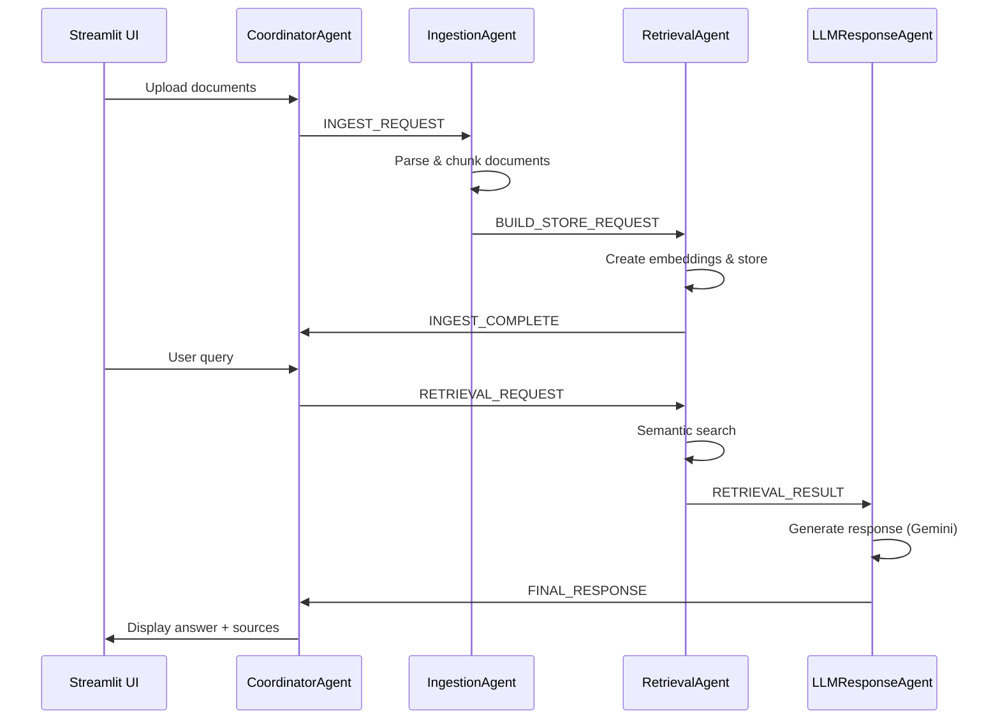

# Agentic-Chatbot
Multi-Agent Chatbot for documents
# 🤖 Agentic RAG Chatbot with Model Context Protocol (MCP)

A production-ready multi-agent Retrieval-Augmented Generation (RAG) chatbot that enables users to query uploaded documents using an agentic architecture with Model Context Protocol for inter-agent communication.

## 🏗️ Architecture Overview


### Multi-Agent System (4 Agents)
- **CoordinatorAgent**: Central orchestrator managing workflow and synchronization
- **IngestionAgent**: Handles document parsing, OCR, and text chunking 
- **RetrievalAgent**: Manages FAISS vector store and semantic search
- **LLMResponseAgent**: Generates responses using Gemini 2.5 Pro

### Model Context Protocol (MCP)
All agents communicate via structured MCP messages:
```json
{
  "sender": "RetrievalAgent",
  "receiver": "LLMResponseAgent", 
  "type": "RETRIEVAL_RESULT",
  "trace_id": "abc-123",
  "payload": {
    "query": "What are the KPIs?",
    "context": ["chunk1", "chunk2"]
  }
}
```

## ✅ Supported Document Formats
- **PDF**: OCR-enabled with Poppler + Tesseract
- **DOCX**: Microsoft Word documents
- **PPTX**: PowerPoint presentations  
- **CSV**: Comma-separated values
- **TXT/MD**: Plain text and Markdown files

## 🛠️ Tech Stack
- **Frontend**: Streamlit (Python web framework)
- **LLM**: Google Gemini 2.5 Pro via LangChain
- **Vector Store**: FAISS with persistence
- **Embeddings**: HuggingFace (all-MiniLM-L6-v2)
- **Message Broker**: Redis Pub/Sub
- **Document Processing**: Unstructured.io + OCR

## 🚀 Quick Setup

### Prerequisites
1. **Python 3.8+**
2. **Redis Server**
   ```bash
   # Using Docker
   docker run -d -p 6379:6379 redis
   
   # Or install locally
   # Windows: https://redis.io/docs/getting-started/installation/install-redis-on-windows/
   # macOS: brew install redis
   # Linux: sudo apt-get install redis-server
   ```

3. **Poppler** (for PDF processing)
   ```bash
   # Windows: Download from https://blog.alivate.com.au/poppler-windows/
   # macOS: brew install poppler  
   # Linux: sudo apt-get install poppler-utils
   ```

4. **Tesseract OCR** (for scanned PDFs)
   ```bash
   # Windows: https://github.com/UB-Mannheim/tesseract/wiki
   # macOS: brew install tesseract
   # Linux: sudo apt-get install tesseract-ocr
   ```

### Installation Steps

1. **Clone the repository**
   ```bash
   git clone <your-repo-url>
   cd agentic-rag-chatbot
   ```

2. **Create virtual environment**
   ```bash
   python -m venv chatbot
   # Windows
   chatbot\Scripts\activate
   # Linux/macOS  
   source chatbot/bin/activate
   ```

3. **Install dependencies**
   ```bash
   pip install -r requirements.txt
   ```

4. **Set up environment variables**
   Create `.env` file in project root:
   ```env
   GOOGLE_API_KEY=your_gemini_api_key_here
   ```

5. **Start Redis server**
   ```bash
   # If using Docker
   docker run -d -p 6379:6379 redis
   
   # If installed locally
   redis-server
   ```

6. **Run the application**
   ```bash
   streamlit run ui/app.py
   ```

7. **Access the application**
   Open http://localhost:8501 in your browser

## 💻 Usage

### Document Upload & Processing
1. Click "Upload documents" in the sidebar
2. Select files (PDF, DOCX, PPTX, CSV, TXT, MD)
3. Click "Process documents"
4. Wait for "KB ready" status

### Querying Documents  
1. Type your question in the chat input
2. View AI-generated response with source attribution
3. Expand "Sources" to see relevant document chunks

### Knowledge Base Management
- **Clear KB**: Remove all processed documents
- **Agent Status**: Monitor system health

## 🔄 System Workflow



## 📁 Project Structure
```
├── agents/
│   ├── coordinator_agent.py    # Central orchestrator
│   ├── ingestion_agent.py      # Document processing
│   ├── retrieval_agent.py      # Vector search
│   └── llm_response_agent.py   # Response generation
├── core/
│   ├── message_broker.py       # Redis pub/sub
│   └── mcp.py                  # Message protocol
├── ui/
│   └── app.py                  # Streamlit interface
├── documents/                  # Uploaded files
├── vector_store/              # FAISS index
├── requirements.txt
├── .env                       # API keys
└── README.md
```

## 🧪 Testing the System

1. **Upload a sample document** (PDF recommended)
2. **Ask basic questions**:
   - "What is this document about?"
   - "Summarize the main points"
   - "What are the key findings?"
3. **Verify source attribution** in expandable sections
4. **Test multi-turn conversations**

## 🔧 Troubleshooting

### Common Issues

**PDF Processing Fails**
```bash
# Error: "poppler not installed"
# Solution: Install Poppler and add to PATH
```

**OCR Errors**  
```bash  
# Error: "tesseract not installed"
# Solution: Install Tesseract OCR
```

**Redis Connection Failed**
```bash
# Error: "Redis connection failed"  
# Solution: Start Redis server
redis-server
```

**Empty Responses**
```bash
# Issue: No documents processed
# Solution: Check document upload and processing logs
```

## 🚀 Future Enhancements

- **Multi-modal support**: Images, audio, video processing
- **Advanced RAG**: Query rewriting, multi-hop reasoning  
- **Scalability**: Kubernetes deployment, load balancing
- **Analytics**: Usage metrics, performance monitoring
- **Security**: Authentication, authorization, data encryption

## 📄 Requirements File

Save as `requirements.txt`:
```
streamlit==1.31.0
langchain==0.1.6
langchain-community==0.0.19
langchain-google-genai==0.0.8
langchain-huggingface==0.0.1
faiss-cpu==1.7.4
redis==5.0.1
python-dotenv==1.0.0
unstructured[pdf]==0.12.4
pdf2image==1.17.0
pytesseract==0.3.10
sentence-transformers==2.2.2
tenacity==8.2.3
pydantic==2.5.3
```

## 🎯 Project Highlights

- ✅ **Complete MCP Implementation**: Structured inter-agent communication
- ✅ **Production-Ready**: Error handling, logging, persistence
- ✅ **Multi-Format Support**: PDF, DOCX, PPTX, CSV, TXT, MD
- ✅ **OCR Capability**: Handles scanned/image PDFs
- ✅ **Real-time UI**: Streamlit with live status updates
- ✅ **Scalable Architecture**: Redis pub/sub messaging
- ✅ **Source Attribution**: Transparent document citations

## 👨‍💻 Author

K Pawan Kalyan  
07007kalyan@gmail.com
Linkedin : https://www.linkedin.com/in/pawan-kalyan-484864257/

## 📜 License
Not Required 
